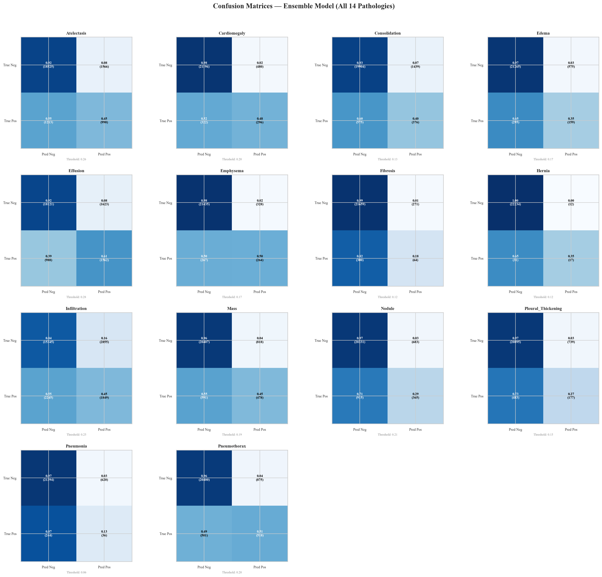
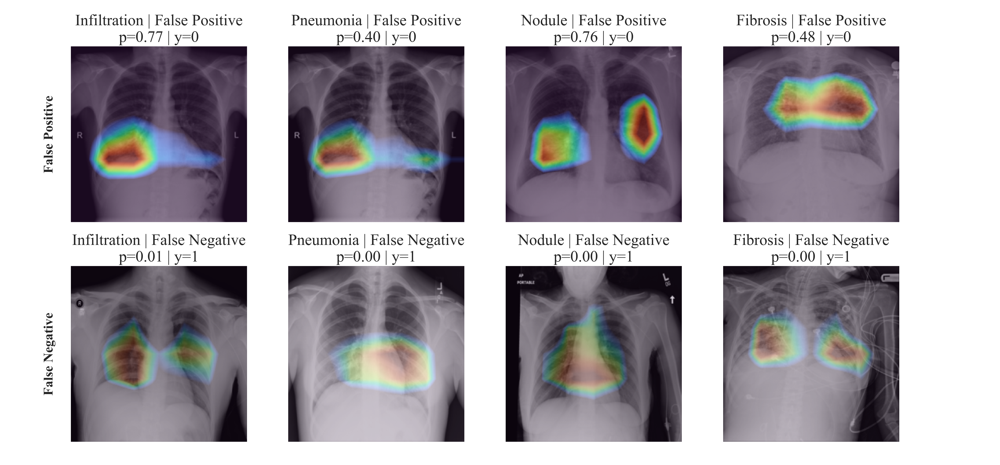

<div align="center">

# Chest X-Ray Impact Analysis

### A systematic ablation study for multi-label thoracic pathology classification on NIH ChestX-ray14

<p>
	
	
	
	
</p>

</div>

## Abstract

This repository presents a structured empirical study of what most influences multi-label chest X-ray performance: augmentation strategy, sampling policy, loss design, and model backbone. Experiments are conducted on NIH ChestX-ray14 with patient-wise split integrity, and evaluated using class-wise and macro AUROC, macro F1, and pairwise DeLong significance testing with Benjamini-Hochberg correction.

The final ensemble improves macro AUROC to 0.850 and shows statistically significant gains on Nodule versus both ResNet50 and Swin after correction.

## Study At A Glance

| Item | Value |
|---|---|
| Dataset | NIH ChestX-ray14 (Kaggle mirror: `khanfashee/nih-chest-x-ray-14-224x224-resized`) |
| Task | 14-label multi-label thoracic pathology classification |
| Split protocol | Patient-wise GroupShuffleSplit (no leakage) |
| Patients | 30,805 |
| Images | 112,120 total (72,061 train, 17,765 val, 22,294 test) |
| Primary metric | Macro AUROC |
| Statistical testing | DeLong pairwise AUROC test + BH correction |
| Backbone family | DenseNet121, EfficientNetV2-S, Swin-S, ResNet50 |

Pathologies: Atelectasis, Cardiomegaly, Consolidation, Edema, Effusion, Emphysema, Fibrosis, Hernia, Infiltration, Mass, Nodule, Pleural_Thickening, Pneumonia, Pneumothorax.

## Method Summary

1. Data curation and patient-wise splitting to avoid identity leakage.
2. Multi-label binarization over 14 thoracic findings.
3. Ablations across:
	 - Augmentation: Elastic, Intensity, Geometric, Combined
	 - Sampling: Random, Median, Weighted, Dynamic
	 - Loss: BCE, Focal, Weighted Focal
	 - Backbone: DenseNet, EfficientNet, Swin, ResNet
4. Evaluation with AUROC-centric model selection and post-hoc statistical testing.
5. Final ensemble inference and failure-case Grad-CAM analysis.

Macro AUROC definition:

$$
\mathrm{MacroAUROC} = \frac{1}{14}\sum_{c=1}^{14}\mathrm{AUROC}_c
$$

## Main Results

### 1) Backbone Comparison (Macro AUROC)

| Model | Macro AUROC |
|---|---:|
| EfficientNetV2-S | 0.836 |
| DenseNet121 | 0.834 |
| Swin-S | 0.832 |
| ResNet50 | 0.830 |
| Ensemble (final) | **0.850** |

### 2) Augmentation Ablation (Macro AUROC)

| Variant | Macro AUROC |
|---|---:|
| Elastic | 0.805 |
| Intensity | 0.818 |
| Geometric | **0.834** |
| Combined | **0.834** |

### 3) Sampling Ablation (Macro AUROC)

| Variant | Macro AUROC |
|---|---:|
| Random | **0.834** |
| Dynamic | 0.823 |
| Weighted | 0.779 |
| Median | 0.521 |

### 4) Loss Ablation (Macro AUROC)

| Variant | Macro AUROC |
|---|---:|
| BCE | **0.834** |
| Focal | 0.831 |
| Weighted Focal | 0.826 |

## Statistical Findings (DeLong + BH)

- Augmentation comparisons show significant differences for selected pairs:
	- Elastic vs Combined: 6 labels
	- Elastic vs Geometric: 3 labels
	- Intensity vs Combined: 1 label
- Sampling comparisons show broad significant differences:
	- Random vs Median: 14 labels
	- Median vs Weighted: 14 labels
	- Median vs Dynamic: 14 labels
	- Weighted vs Dynamic: 11 labels
- Loss comparisons: no significant pairwise differences after correction.
- Backbone comparisons (single models): no significant pairwise differences after correction.
- Ensemble analysis:
	- ResNet50 vs Ensemble: 1 significant label
	- Swin vs Ensemble: 1 significant label
	- DenseNet vs Ensemble: 0
	- EfficientNet vs Ensemble: 0
	- Exported significant findings (`artifacts/inference_analysis/delong_significant_comparisons.csv`) indicate Nodule as significant against Ensemble for both ResNet50 and Swin (BH-adjusted `p = 0.04894`).

## Visual Artifacts

<p align="center">
	
	
</p>

## Repository Layout

```text
.
|- MAIN_TRAINING_NOTEBOOK.ipynb
|- notebooks/
|  |- 01-data_analysis.ipynb
|  |- 02-training_notebook.ipynb
|  |- 03-augmentation_comparison.ipynb
|  |- 04-sampling_comparison.ipynb
|  |- 05-loss_comparison.ipynb
|  |- 06-model_comparison.ipynb
|  |- 07-final_inference_analysis.ipynb
|- weights/
|  |- DYNAMICSMAPLING.pth
|  |- EFFICIENTNET.pth
|  |- ELASTIC.pth
|  |- FOCAL.pth
|  |- GEOMETRIC.pth
|  |- INTENSITY.pth
|  |- MEDIANSAMPLING.pth
|  |- RANDOMSAMPLING.pth
|  |- RESNET50.pth
|  |- SWIN.pth
|  |- WEIGHTEDFOCAL.pth
|  |- WEIGHTEDSAMPLING.pth
|- artifacts/
|  |- inference_analysis/
|     |- delong_significant_comparisons.csv
|     |- failure_case_analysis_gradcam.png
```

## Reproducibility

### Environment

```bash
python -m venv .venv
.venv\\Scripts\\activate
python -m pip install --upgrade pip
pip install torch torchvision timm albumentations opencv-python pandas numpy scikit-learn matplotlib tqdm wandb kagglehub jupyterlab
```

### Baseline Training Settings (from notebook configuration)

- Seed: `42`
- Image size: `224 x 224`
- Batch size: `64`
- Epochs: `25`
- Warmup epochs: `3`
- Learning rate: `1e-4`
- Optimizer: `AdamW`
- Loss baseline: `BCEWithLogitsLoss`
- Dynamic sampler controls: `EMA_ALPHA=0.3`, `MIX_ALPHA=0.5`

### Recommended Execution Order

1. `notebooks/01-data_analysis.ipynb`
2. `notebooks/02-training_notebook.ipynb`
3. `notebooks/03-augmentation_comparison.ipynb`
4. `notebooks/04-sampling_comparison.ipynb`
5. `notebooks/05-loss_comparison.ipynb`
6. `notebooks/06-model_comparison.ipynb`
7. `notebooks/07-final_inference_analysis.ipynb`

## Notes On Clinical Use

This project is for research and educational use. It is not a diagnostic device and must not be used as a standalone clinical decision system. External validation, bias analysis, calibration checks, and safety review are mandatory before any real-world deployment.

## Citation

If this repository supports your work, please cite it:

```bibtex
@misc{guliyev2026chestxrayimpact,
  author       = {Nifdi Guliyev},
  title        = {Chest X-Ray Impact Analysis: Ablation Study of Augmentation, Sampling, Loss, and Backbone Design},
  year         = {2026},
  howpublished = {GitHub repository},
  url          = {https://github.com/<your-username>/chest-xray-impact-analysis},
  note         = {Accessed 2026-04-25}
}
```

## License

Licensed under Apache License 2.0. See `LICENSE`.
